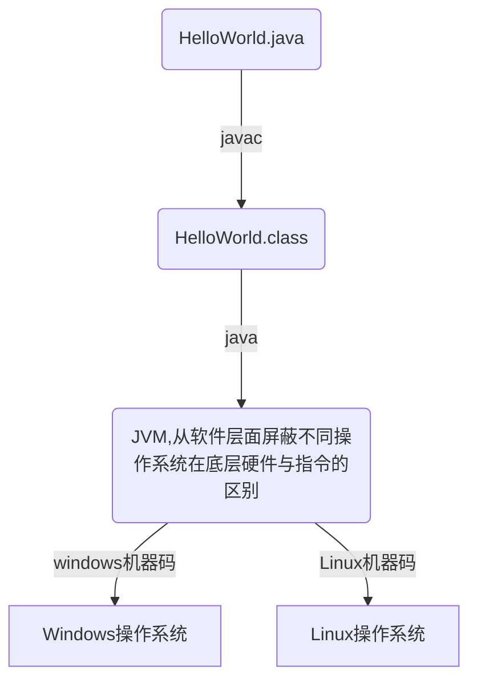

## JVM性能调优

### JVM基础

```mermaid
graph TD
    heloWorld(HelloWorld.java) --->|javac| helloWorld(HelloWorld.class)
    helloWorld(HelloWorld.class) --->|java| JVM(JVM,从软件层面屏蔽不同操作系统在底层硬件与指令的区别)
    JVM(JVM,从软件层面屏蔽不同操作系统在底层硬件与指令的区别) -->|windows机器码| Windows操作系统
    JVM(JVM,从软件层面屏蔽不同操作系统在底层硬件与指令的区别) -->|Linux机器码| Linux操作系统
    
```

### 内存模型

* 运行时数据区
  * 堆
  * 栈   FILO(First in last out)
  * 本地方法栈
  * 方法区(元空间)
  * 程序计数器

