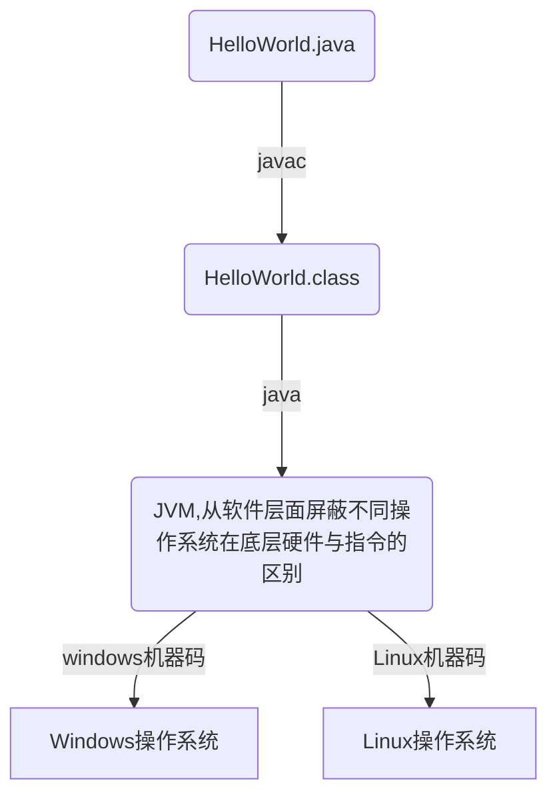

## JVM性能调优

### JVM基础

### 内存模型

* 运行时数据区
  * 堆
  * 栈   FILO(First in last out)
    * 局部变量表
    * 操作数据栈
    * 动态链表
    * 方法出口
  * 本地方法栈
  * 方法区(元空间)
    * 常量
    * 静态变量
    * 类信息
  * 程序计数器

### MINOR GC

-------------

*HotSpot  JVM把年轻代分为了三部分：1个Eden区和2个Survivor区（分别叫from和to）。默认比例为8：1,为啥默认会是这个比例，接下来我们会聊到。一般情况下，新创建的对象都会被分配到Eden区(一些大对象特殊处理),这些对象经过第一次Minor GC后，如果仍然存活，将会被移到Survivor区。对象在Survivor区中每熬过一次Minor  GC，年龄就会增加1岁，当它的年龄增加到一定程度时(15岁)，就会被移动到年老代中。因为年轻代中的对象基本都是朝生夕死的(80%以上)，所以在年轻代的垃圾回收算法使用的是复制算法，复制算法的基本思想就是将内存分为两块，每次只用其中一块，当这一块内存用完，就将还活着的对象复制到另外一块上面。复制算法不会产生内存碎片*

**当老年代满了，会触发对堆内存空间做full gc，如果空间依旧没有回收出来空空间就会OOM内存溢出**

*字节码执行引擎执行GC，对年轻代进行垃圾收集*

**可达性分析算法：将 GC ROOT 对象(线程栈的本地变量，静态变量，本地方法栈的变量)作为起点，从这些节点开始向下搜索引用的对象，找到的对象都标记为非垃圾，其余未标记的对象都是垃圾对象，然后将eden区标记的非垃圾独享复制到survivor区**

### Arthas调优工具

----

[Arthas文档](https://arthas.aliyun.com/doc/install-detail.html)

### 调优案例-调整内存比例

**假设老年代分配2G，eden800M，S0和S1区分别分配100M内存大小，当每秒线程中局部变量占满eden区时，触发MINOR GC，此时触发STW，将线程中还在引用堆中的对象挪至S0区，如果这些对象大于S0区域的一半以上会将这批对象挪至老年代中，而每次minor GC都不会回收老年代对象，导致频繁触发full gc**

------

**解决方案：调整eden区所占比例，比如将eden区比例提高为1.6G，S0和S1区域分别分配200M，老年代区域调整为1G，将这批对象尽量在minor gc过程中被回收掉，防止超过S0或S1区域内存大小的一半以上**

### 调优案例-选中不同的垃圾收集器

**假设一台机器需要接受kafka每秒十万级别数据冲击，首先需要一台内存很大的机器，比如64G，eden区假设分配30G大小，那么每次minor gc需要耗费很久的时间，所以可以选择G1垃圾收集器进行空间切割minor gc,默认每次收集200ms大小的空间，然后每次触发minor gc需要耗费的时间短，空间回收更及时，排除了整块eden区进行minor gc造成STW线程暂停导致超时的结果**
